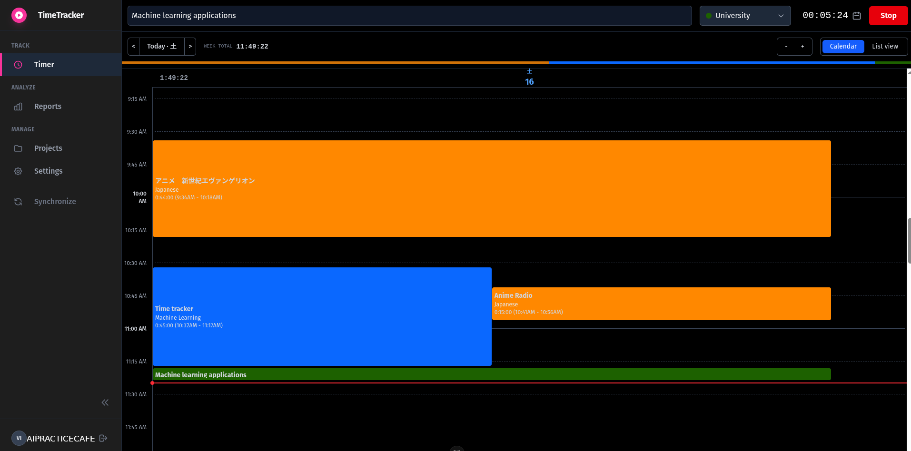
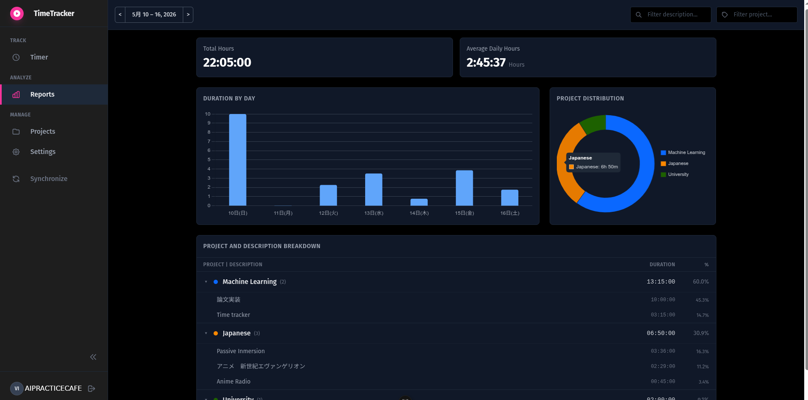

# Local Time Tracker

> A privacy-first, self-hosted time tracking application inspired by Toggl Track.
> Built for developers who want full control over their data without relying on
> external cloud services.

This project is a full-stack web application designed to help you manage your
time effectively. It runs locally, ensuring your data remains private, while
providing a modern, reactive interface for tracking tasks, visualizing
productivity, and managing projects.

## ✨ Features

#### Core Tracking

* **Live Timer**: Start and stop tasks in real-time. The interface prevents
  multiple running timers to ensure data consistency.
* **Smart Suggestions**: As you type a task description, the app suggests
  previously used entries to save time.
* **Interactive Calendar**: A visual grid (Day/Week view) where you can
  create time entries by clicking and dragging. Move and resize blocks to
  adjust your schedule intuitively.

#### Data Management

* **Project Organization**: Group your time entries by projects, each with
  custom colors for easy visual identification in the calendar and reports.
* **Data Portability**: Full JSON export and import functionality. You can
  move your data between machines or back it up without database knowledge.

#### Insights

* **Summary Dashboard**: Visualize your productivity with bar charts showing
  daily duration and donut charts for project distribution.
* **Detailed Breakdown**: View aggregated data by project and time entry for
  specific date ranges.

## 📖 User Workflow

1. **Login**: Access the app via the secure login page.
2. **Create Project**: Define a project (e.g., "Development", "Learning") and
   assign it a color.
3. **Track Time**:
   * **Live**: Type "Fixing bugs", select "Development" project, and hit Start.
   * **Manual**: Go to the Calendar, click on 10:00 AM, and drag down to
     11:30 AM to create a block.
4. **Analyze**: Switch to the Summary view to see how many hours you spent on
   "Development" this week.
5. **Backup/Sync**: Go to Settings to export your history to a JSON file, or use the sidebar Sync button to automatically encrypt and backup your data to a local drive.





## 🚀 Technology Stack

* **Backend**: Django REST Framework (Python). Handles API logic, data
  validation, and authentication (JWT).
* **Frontend**: Vue 3 (Composition API). A reactive SPA built with Vite.
* **State Management**: Vuex. Centralized store for auth, time data, and UI state.
* **Styling**: Tailwind CSS. Utility-first styling for a clean, dark-mode aesthetic.
* **Database**: SQLite. Lightweight and file-based for easy local deployment.

## 📚 Documentation

For developers looking to customize the app, understand the architecture, or contribute, please refer to the [Developer Guide](docs/DEVELOPERS.md).

To see pending tasks and known issues, check the [TODO](TODO.md) file.

## ⚙️ Getting Started

This project is designed to be easily forked and customized. Follow these
steps to get it running locally.

### Prerequisites

* Python 3.11+
* Node.js 22+

### 1. Backend Setup (Django)

Navigate to the backend directory and set up the Python environment.

```bash
# 1. Clone the repository
git clone https://codeberg.org/yourusername/time-tracker.git
cd time-tracker

# 2. Create a virtual environment
python -m venv venv
source venv/bin/activate  # On Windows use `venv\Scripts\activate`

# 3. Install dependencies
pip install -r requirements.txt

# 4. Apply database migrations
cd backend
python manage.py migrate

# 5. Create a superuser (for admin access)
python manage.py createsuperuser

# 6. Run the server
python manage.py runserver
```

The API will be available at `http://localhost:8000/api/`.

### 2. Frontend Setup (Vue 3)

Open a new terminal and navigate to the frontend directory.

```bash
cd frontend

# 1. Install Node dependencies
npm install

# 2. Run the development server
npm run dev
```

The application will be available at `http://localhost:5173/`.

### 3. Environment Configuration

Create a `.env` file in the `root` directory (next to
this `README.md`) to manage secrets.

```ini
# .env

# Security: Change this in production!
SECRET_KEY='django-insecure-your-secret-key-here'

# Set to True for development debugging
DEBUG=True

# Name of the remote configured in rclone config
REMOTE_NAME="my_gdrive"

# Folder on Google Drive
REMOTE_PATH="timer_data"

# Local folder where Django reads/writes
LOCAL_MOUNT="./mnt_data"

MACHINE_ID="laptop"
# Key used for the encryption
SYNC_SECRET_KEY="YOUR-ENCRYPT-KEY"
```

#### Setting up Drive Synchronization (Rclone & Fernet Key)

To enable automatic cloud synchronization across multiple machines, the app uses `rclone` to sync an encrypted data folder. This ensures your data remains completely private even when hosted on third-party cloud providers.

1. **Generate the Encryption Key**: The app uses Fernet symmetric encryption to secure your data before it leaves your machine. Generate a secure key by running the following command in your terminal:

```bash
python -c "from cryptography.fernet import Fernet; print(Fernet.generate_key().decode())"
```

Copy the output and set it as `SYNC_SECRET_KEY` in your `.env` file. **Keep this key safe and use the exact same key on your other machines** so they can decrypt the synced data.

1. **Set up Rclone**:
   * Install [Rclone](https://rclone.org/downloads/).
   * Run `rclone config` in your terminal and follow the interactive prompts to connect to your preferred cloud provider (e.g., Google Drive, Dropbox, OneDrive).
   * Note the name you give this remote connection (e.g., `my_gdrive`) and set it as `REMOTE_NAME` in your `.env` file.
   * Set `REMOTE_PATH` to the folder inside your cloud drive where you want the encrypted data stored.
   * Set `MACHINE_ID` to a unique name for each computer you use (e.g., `laptop-linux`, `desktop-windows`). This prevents unnecessary downloads when the same machine updates the data.

After setting up the app, it can be runned using the provided `launch_app.sh` for linux and `launch_win.bat` for windows users. They both use mamba for activating the environment so if using pyenv or uv this scripts should be updated.

### 4. Running tests

Both the frontend and backend include tests.

* **Backend** (uses `pytest-django`):

```bash
cd backend/api
pytest
```

* **Frontend** (uses `vitest`):

```bash
cd frontend
npm run test
```

## 📦 Production Build (Optional)

To serve the frontend via Django (removing the need for two running terminals),
you can build the Vue app.

1. **Build Frontend**:

```bash
cd frontend
npm run build
```

This generates static files in `frontend/dist`.

1. **Collect Static**:

```bash
cd ../backend
python manage.py collectstatic
```

1. **Run Django**:

```bash
python manage.py runserver
```

The app is now served directly at `http://localhost:8000/`.

## Author

[aipracticecafe-codeberg](https://codeberg.org/aipracticecafe)
[aipracticecafe-github](https://github.com/deeplearningcafe)

## License

This project is licensed under the `Apache license 2.0`. Details are in the [LICENSE](LICENSE.txt) file. This project is not aimed to completely replace commercial trackers, but to provide a local alternative for **individual** users to understand their time habits and control their privacy.
